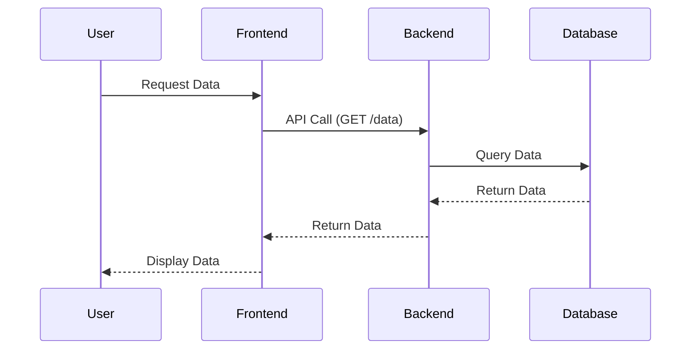

# รายงานเทมเพลตสำหรับการทำงานร่วมกับ AI

## สารบัญ
1.  [บทนำ](#บทนำ)
2.  [เทมเพลตสำหรับ GitHub](#เทมเพลตสำหรับ-github)
    *   [Issue Template](#issue-template)
    *   [Pull Request (PR) Template](#pull-request-pr-template)
    *   [README Template](#readme-template)
3.  [เทมเพลตเอกสารโปรเจกต์](#เทมเพลตเอกสารโปรเจกต์)
    *   [API Documentation Template](#api-documentation-template)
    *   [Architecture Document Template](#architecture-document-template)
4.  [เทมเพลตกฎสำหรับ Cursor (Cursor Rules Template)](#เทมเพลตกฎสำหรับ-cursor-cursor-rules-template)
    *   [AGENTS.md Template](#agentsmd-template)
    *   [Rules (.mdc) Template](#rules-mdc-template)
    *   [Custom Command Template](#custom-command-template)
5.  [เทมเพลตสำหรับ Stack และ Frameworks](#เทมเพลตสำหรับ-stack-และ-frameworks)
    *   [TypeScript/Node.js Project Template](#typescriptnodejs-project-template)
    *   [Python Project Template](#python-project-template)
    *   [Multi-cloud/MCP Development Context Rule](#multi-cloudmcp-development-context-rule)
6.  [เทมเพลตสำหรับงานทั่วไป](#เทมเพลตสำหรับงานทั่วไป)
    *   [สรุป (Summary)](#สรุป-summary)
    *   [เรียบเรียง (Refinement/Restructuring)](#เรียบเรียง-refinementrestructuring)
    *   [สร้าง Task/Subtask/Checklist](#สร้าง-tasksubtaskchecklist)
    *   [รายงานนำเสนอผู้บริหาร](#รายงานนำเสนอผู้บริหาร)
7.  [ภาคผนวก](#ภาคผนวก)
    *   [แนวทางการใช้ One-Click Install Links](#แนวทางการใช้-one-click-install-links)
    *   [MCP Servers ที่น่าสนใจ](#mcp-servers-ที่น่าสนใจ)
    *   [Client ที่รองรับ MCP](#client-ที่รองรับ-mcp)
    *   [การจัดการ Context และ Prompt Caching ใน Cursor](#การจัดการ-context-และ-prompt-caching-ใน-cursor)
    *   [การใช้ @ (Context Symbols) ใน Cursor](#การใช้-context-symbols-ใน-cursor)
    *   [การตั้งค่า .cursorignore และ Configuration Files](#การตั้งค่า-cursorignore-และ-configuration-files)
    *   [การ Debugging MCP Integrations](#การ-debugging-mcp-integrations)
8.  [สรุปและข้อเสนอแนะเพิ่มเติม](#สรุปและข้อเสนอแนะเพิ่มเติม)

---

## 1. บทนำ

รายงานฉบับนี้จัดทำขึ้นเพื่อรวบรวมและนำเสนอเทมเพลตเอกสารต่างๆ ที่สามารถนำไปประยุกต์ใช้ในการทำงานร่วมกับ AI โดยเฉพาะอย่างยิ่งกับเครื่องมืออย่าง Cursor เพื่อเพิ่มประสิทธิภาพและลดระยะเวลาในการทำงาน การใช้เทมเพลตที่ได้มาตรฐานจะช่วยให้การสื่อสารชัดเจนขึ้น การจัดการโปรเจกต์เป็นระบบ และการพัฒนาซอฟต์แวร์เป็นไปอย่างราบรื่นยิ่งขึ้น

เทมเพลตที่นำเสนอครอบคลุมตั้งแต่เอกสารสำหรับ GitHub (Issue, PR, README) เอกสารโปรเจกต์ทั่วไป กฎและคำสั่งเฉพาะสำหรับ Cursor ไปจนถึงเทมเพลตสำหรับ Stack/Frameworks ต่างๆ และงานบริหารจัดการทั่วไป นอกจากนี้ยังมีภาคผนวกที่ให้ข้อมูลเชิงลึกและคำแนะนำเพิ่มเติมเกี่ยวกับการใช้งาน Cursor และ Model Context Protocol (MCP) เพื่อให้ผู้ใช้สามารถนำไปปรับใช้ได้อย่างเต็มศักยภาพ

---

## 2. เทมเพลตสำหรับ GitHub

GitHub เป็นแพลตฟอร์มสำคัญสำหรับการทำงานร่วมกันในการพัฒนาซอฟต์แวร์ การมีเทมเพลตที่ชัดเจนสำหรับ Issue, Pull Request และ README จะช่วยให้ทีมสามารถสื่อสารและจัดการโค้ดได้อย่างมีประสิทธิภาพ

### Issue Template

เทมเพลตนี้ใช้สำหรับรายงานข้อผิดพลาด (Bug Report) หรือเสนอคุณสมบัติใหม่ (Feature Request) เพื่อให้ข้อมูลที่จำเป็นครบถ้วนและช่วยให้ทีมสามารถทำความเข้าใจและแก้ไขปัญหาได้อย่างรวดเร็ว

```markdown
---
name: Bug Report
about: Report a bug to help us improve
title: "[BUG] - "
labels: [bug, triage]
assignees: ''
---

## 🐛 รายงานข้อผิดพลาด (Bug Report)

**อธิบายข้อผิดพลาด:**
[คำอธิบายที่ชัดเจนและกระชับเกี่ยวกับข้อผิดพลาดที่พบ]

**ขั้นตอนในการทำซ้ำ (To Reproduce):**
1.  ไปที่ `[URL หรือตำแหน่งในแอปพลิเคชัน]`
2.  คลิกที่ `[ปุ่ม/ลิงก์/ฟังก์ชัน]`
3.  ทำ `[การกระทำที่ 3]`
4.  เห็นข้อผิดพลาด `[ข้อความแสดงข้อผิดพลาด/พฤติกรรมที่ไม่คาดคิด]`

**พฤติกรรมที่คาดหวัง:**
[อธิบายว่าอะไรควรจะเกิดขึ้น]

**ภาพหน้าจอ (Screenshots):**
[ถ้ามี ให้แนบภาพหน้าจอหรือวิดีโอเพื่อช่วยอธิบายปัญหา]

**สภาพแวดล้อม:**
*   **ระบบปฏิบัติการ:** [เช่น macOS, Windows 11, Ubuntu 22.04]
*   **เบราว์เซอร์:** [เช่น Chrome, Firefox, Safari]
*   **เวอร์ชันของแอปพลิเคชัน:** [เช่น v1.0.0]

**ข้อมูลเพิ่มเติม (Optional):**
[ข้อมูลอื่นๆ ที่อาจเป็นประโยชน์ เช่น log files, stack traces]

---
name: Feature Request
about: Suggest an idea for this project
title: "[FEAT] - "
labels: [enhancement, feature]
assignees: ''
---

## ✨ ข้อเสนอแนะคุณสมบัติใหม่ (Feature Request)

**คุณสมบัติที่ต้องการ:**
[อธิบายคุณสมบัติใหม่ที่คุณต้องการให้เพิ่มเข้ามา]

**ทำไมถึงต้องการคุณสมบัตินี้:**
[อธิบายปัญหาที่ต้องการแก้ไข หรือประโยชน์ที่จะได้รับจากคุณสมบัตินี้]

**แนวคิดในการใช้งาน:**
[อธิบายว่าคุณสมบัตินี้ควรทำงานอย่างไร หรือมีตัวอย่างการใช้งานแบบไหน]

**ประโยชน์ที่คาดว่าจะได้รับ:**
[ระบุว่าคุณสมบัตินี้จะช่วยปรับปรุงอะไรบ้าง]

**ข้อมูลเพิ่มเติม (Optional):**
[ข้อมูลอื่นๆ ที่อาจเป็นประโยชน์ เช่น ตัวอย่างจากแอปพลิเคชันอื่น, ภาพร่าง]
```

### Pull Request (PR) Template

เทมเพลตนี้ช่วยให้ผู้พัฒนาสามารถให้ข้อมูลที่ครบถ้วนเกี่ยวกับ Pull Request ของตน ทำให้กระบวนการรีวิวโค้ดรวดเร็วและมีประสิทธิภาพยิ่งขึ้น

```markdown
## 🚀 การเปลี่ยนแปลงที่เกิดขึ้น (Changes Made)

*   [ ] เพิ่มคุณสมบัติใหม่ `[ชื่อคุณสมบัติ]`
*   [ ] แก้ไขข้อผิดพลาด `[ชื่อข้อผิดพลาด]`
*   [ ] ปรับปรุงประสิทธิภาพ/Refactor โค้ดในส่วน `[ส่วนที่ปรับปรุง]`
*   [ ] เพิ่ม/อัปเดตเอกสาร `[ชื่อเอกสาร]`
*   [ ] อื่นๆ: `[ระบุ]`

## ✅ การทดสอบ (Testing)

*   [ ] Unit tests ผ่านทั้งหมด
*   [ ] Integration tests ผ่านทั้งหมด
*   [ ] การทดสอบด้วยตนเอง (Manual testing) ได้ดำเนินการแล้วใน `[สภาพแวดล้อมที่ทดสอบ]`
*   [ ] ครอบคลุม Edge cases และ Error handling

## 📸 ภาพหน้าจอ (Screenshots)

[ถ้ามีการเปลี่ยนแปลง UI หรือพฤติกรรมที่มองเห็นได้ ให้แนบภาพหน้าจอหรือวิดีโอ ก่อน/หลัง การเปลี่ยนแปลง]

## 📝 สิ่งที่ต้องพิจารณาเพิ่มเติม (Further Considerations)

*   [ ] มีการอัปเดต Dependencies หรือไม่? ถ้ามี ให้ระบุ: `[รายการ Dependencies]`
*   [ ] มีผลกระทบต่อส่วนอื่นของระบบหรือไม่? ถ้ามี ให้ระบุ: `[ผลกระทบ]`
*   [ ] ต้องการการรีวิวจากผู้เชี่ยวชาญเฉพาะทางหรือไม่? ถ้ามี ให้ระบุ: `[ชื่อผู้เชี่ยวชาญ/ทีม]`

## 🔗 ลิงก์ที่เกี่ยวข้อง (Related Links)

*   [Issue #XXX](https://github.com/your-org/your-repo/issues/XXX)
*   [Design Document](https://your-design-doc-link.com)

## 👤 ผู้รีวิว (Reviewers)

@`[ชื่อผู้รีวิว 1]` @`[ชื่อผู้รีวิว 2]`
```

### README Template

ไฟล์ `README.md` เป็นหน้าแรกของโปรเจกต์ที่ให้ข้อมูลสำคัญแก่ผู้ใช้งานและผู้ร่วมพัฒนา เทมเพลตนี้ช่วยให้มั่นใจว่าข้อมูลที่จำเป็นครบถ้วนและนำเสนออย่างเป็นระเบียบ

```markdown
# 🌟 ชื่อโปรเจกต์ (Project Name)

[](https://opensource.org/licenses/MIT)
[](https://your-ci-cd-link.com)
[](https://your-coverage-link.com)

## 📝 คำอธิบายโปรเจกต์ (Project Description)

[คำอธิบายสั้นๆ แต่ครอบคลุมว่าโปรเจกต์นี้คืออะไร ทำอะไรได้บ้าง และมีวัตถุประสงค์อะไร]

## ✨ คุณสมบัติหลัก (Features)

*   คุณสมบัติที่ 1
*   คุณสมบัติที่ 2
*   คุณสมบัติที่ 3

## 🛠️ เทคโนโลยีที่ใช้ (Tech Stack)

*   **Frontend:** [เช่น React, Vue.js, Next.js, HTML, CSS, JavaScript]
*   **Backend:** [เช่น Node.js, Python (Flask/Django), Go, Java]
*   **Database:** [เช่น PostgreSQL, MongoDB, MySQL, Redis]
*   **Deployment:** [เช่น Docker, Kubernetes, AWS, GCP, Azure]
*   **Other:** [เช่น TypeScript, Tailwind CSS, GraphQL]

## 🚀 การติดตั้ง (Installation)

ทำตามขั้นตอนเหล่านี้เพื่อติดตั้งและรันโปรเจกต์บนเครื่องของคุณ:

### ข้อกำหนดเบื้องต้น (Prerequisites)

*   [รายการซอฟต์แวร์ที่จำเป็นและเวอร์ชัน เช่น Node.js v18+, Python 3.9+, Docker]

### ขั้นตอนการติดตั้ง (Steps)

1.  **Clone repository:**
    ```bash
    git clone https://github.com/your-org/your-repo.git
    cd your-repo
    ```

2.  **ติดตั้ง Dependencies:**
    ```bash
    # สำหรับ Node.js
    npm install
    # หรือ yarn install

    # สำหรับ Python
    pip install -r requirements.txt
    ```

3.  **ตั้งค่า Environment Variables:**
    สร้างไฟล์ `.env` ใน root directory และเพิ่มตัวแปรที่จำเป็น (ดู `example.env` ประกอบ)
    ```dotenv
    # ตัวอย่าง .env
    DB_HOST=localhost
    DB_PORT=5432
    API_KEY=your_api_key
    ```

4.  **รันโปรเจกต์:**
    ```bash
    # สำหรับ Node.js
    npm start
    # หรือ yarn start

    # สำหรับ Python
    python app.py
    ```

## 💡 การใช้งาน (Usage)

[อธิบายวิธีการใช้งานโปรเจกต์ พร้อมตัวอย่างโค้ดหรือคำสั่งที่ชัดเจน]

```bash
# ตัวอย่างการใช้งาน
python script.py --input data.csv
```

## 🤝 การมีส่วนร่วม (Contributing)

เรายินดีรับการมีส่วนร่วมจากทุกคน! หากคุณต้องการช่วยพัฒนาโปรเจกต์นี้ โปรดอ่าน [CONTRIBUTING.md](CONTRIBUTING.md) สำหรับแนวทาง

## 📄 ใบอนุญาต (License)

โปรเจกต์นี้อยู่ภายใต้ลิขสิทธิ์ MIT License - ดูไฟล์ [LICENSE](LICENSE) สำหรับรายละเอียดเพิ่มเติม

## 📞 ติดต่อ (Contact)

[ชื่อของคุณ/ทีม] - [อีเมลของคุณ]

ลิงก์โปรเจกต์: [https://github.com/your-org/your-repo](https://github.com/your-org/your-repo)
```

---

## 3. เทมเพลตเอกสารโปรเจกต์

เอกสารโปรเจกต์ที่ดีเป็นสิ่งสำคัญสำหรับการบำรุงรักษา การขยาย และการทำความเข้าใจระบบ การมีเทมเพลตจะช่วยให้เอกสารมีความสอดคล้องกันและครบถ้วน

### API Documentation Template

เทมเพลตนี้ใช้สำหรับจัดทำเอกสาร API เพื่อให้ผู้ใช้งานและผู้พัฒนาสามารถเข้าใจวิธีการเรียกใช้และผลลัพธ์ที่คาดหวังได้อย่างชัดเจน

```markdown
# 📚 เอกสารประกอบ API: [ชื่อ API]

## 📝 คำอธิบาย (Overview)

[คำอธิบายโดยรวมของ API นี้ วัตถุประสงค์ และฟังก์ชันการทำงานหลัก]

## 🔗 Base URL

`[https://api.yourdomain.com/v1]`

## 🔐 การยืนยันตัวตน (Authentication)

API นี้ใช้ `[ประเภทการยืนยันตัวตน เช่น Bearer Token, API Key]`

โปรดระบุ `Authorization: Bearer <YOUR_TOKEN>` ใน Header สำหรับทุกคำขอ

## 💡 อัตราการเรียกใช้ (Rate Limiting)

[ถ้ามี ให้ระบุข้อจำกัดในการเรียกใช้ API เช่น 100 requests/minute]

## 🚀 Endpoints

### 1. `GET /users` - ดึงข้อมูลผู้ใช้ทั้งหมด

**คำอธิบาย:** ดึงรายการผู้ใช้ทั้งหมดในระบบ

**Parameters:**

| ชื่อ Parameter | ประเภท | จำเป็น | คำอธิบาย |
| :------------- | :----- | :----- | :-------- |
| `limit`        | Integer | ไม่จำเป็น | จำนวนผู้ใช้สูงสุดที่จะดึงกลับมา (ค่าเริ่มต้น: 100) |
| `offset`       | Integer | ไม่จำเป็น | จำนวนผู้ใช้ที่จะข้ามไป (สำหรับ Pagination) |

**ตัวอย่างคำขอ (Request Example):**

```bash
curl -X GET \
  'https://api.yourdomain.com/v1/users?limit=10&offset=0' \
  -H 'Accept: application/json' \
  -H 'Authorization: Bearer YOUR_TOKEN'
```

**ตัวอย่างการตอบกลับ (Response Example - 200 OK):**

```json
{
  "data": [
    {
      "id": "user-123",
      "name": "John Doe",
      "email": "john.doe@example.com"
    },
    {
      "id": "user-456",
      "name": "Jane Smith",
      "email": "jane.smith@example.com"
    }
  ],
  "total": 200,
  "limit": 10,
  "offset": 0
}
```

**การตอบกลับข้อผิดพลาด (Error Response - 401 Unauthorized):**

```json
{
  "error": "Unauthorized",
  "message": "Invalid authentication token"
}
```

### 2. `POST /users` - สร้างผู้ใช้ใหม่

**คำอธิบาย:** สร้างผู้ใช้ใหม่ในระบบ

**Parameters (Body):**

| ชื่อ Parameter | ประเภท | จำเป็น | คำอธิบาย |
| :------------- | :----- | :----- | :-------- |
| `name`         | String | จำเป็น | ชื่อของผู้ใช้ |
| `email`        | String | จำเป็น | อีเมลของผู้ใช้ (ต้องไม่ซ้ำ) |
| `password`     | String | จำเป็น | รหัสผ่านของผู้ใช้ (อย่างน้อย 8 ตัวอักษร) |

**ตัวอย่างคำขอ (Request Example):**

```bash
curl -X POST \
  'https://api.yourdomain.com/v1/users' \
  -H 'Content-Type: application/json' \
  -H 'Authorization: Bearer YOUR_TOKEN' \
  -d '{
    "name": "New User",
    "email": "new.user@example.com",
    "password": "securepassword123"
  }'
```

**ตัวอย่างการตอบกลับ (Response Example - 201 Created):**

```json
{
  "id": "user-789",
  "name": "New User",
  "email": "new.user@example.com"
}
```

**การตอบกลับข้อผิดพลาด (Error Response - 400 Bad Request):**

```json
{
  "error": "Bad Request",
  "message": "Email already exists"
}
```

## 🔄 การจัดการข้อผิดพลาด (Error Handling)

API จะส่งคืนรหัสสถานะ HTTP ที่เหมาะสมพร้อมกับโครงสร้าง JSON สำหรับข้อผิดพลาดดังนี้:

```json
{
  "error": "[ประเภทข้อผิดพลาด เช่น Unauthorized, Bad Request]",
  "message": "[คำอธิบายข้อผิดพลาด]"
}
```

| รหัสสถานะ HTTP | คำอธิบาย |
| :------------- | :-------- |
| `200 OK`       | คำขอสำเร็จ |
| `201 Created`  | ทรัพยากรถูกสร้างขึ้นสำเร็จ |
| `400 Bad Request` | คำขอไม่ถูกต้อง (เช่น ข้อมูลไม่ครบถ้วน, รูปแบบไม่ถูกต้อง) |
| `401 Unauthorized` | ไม่มีการยืนยันตัวตนหรือโทเค็นไม่ถูกต้อง |
| `403 Forbidden` | ไม่ได้รับอนุญาตให้เข้าถึงทรัพยากร |
| `404 Not Found` | ไม่พบทรัพยากรที่ร้องขอ |
| `500 Internal Server Error` | ข้อผิดพลาดภายในเซิร์ฟเวอร์ |

## 💡 ข้อมูลเพิ่มเติม (Additional Notes)

[ข้อมูลอื่นๆ ที่เป็นประโยชน์ เช่น ข้อจำกัด, ข้อควรระวัง, หรือเวอร์ชันของ API]
```

### Architecture Document Template

เอกสารสถาปัตยกรรมระบบให้ภาพรวมเชิงลึกของโครงสร้าง การออกแบบ และส่วนประกอบต่างๆ ของระบบ ช่วยให้ผู้มีส่วนได้ส่วนเสียเข้าใจภาพรวมทางเทคนิค

```markdown
# 🏛️ เอกสารสถาปัตยกรรมระบบ: [ชื่อระบบ]

## 📝 บทนำ (Introduction)

[คำอธิบายสั้นๆ เกี่ยวกับระบบนี้ วัตถุประสงค์ และขอบเขตของเอกสาร]

## 🎯 วัตถุประสงค์ (Goals)

*   [วัตถุประสงค์ที่ 1]
*   [วัตถุประสงค์ที่ 2]
*   [วัตถุประสงค์ที่ 3]

## 📏 ข้อจำกัดและข้อสมมติฐาน (Constraints and Assumptions)

### ข้อจำกัด (Constraints)

*   [ข้อจำกัดที่ 1 เช่น ต้องทำงานบน AWS เท่านั้น, ใช้ภาษา Python เท่านั้น]
*   [ข้อจำกัดที่ 2]

### ข้อสมมติฐาน (Assumptions)

*   [ข้อสมมติฐานที่ 1 เช่น ผู้ใช้จะมีการเชื่อมต่ออินเทอร์เน็ตที่เสถียร]
*   [ข้อสมมติฐานที่ 2]

## 🗺️ ภาพรวมสถาปัตยกรรม (Architectural Overview)

[ภาพรวมระดับสูงของสถาปัตยกรรมระบบ อาจมี Diagram ประกอบ]

```mermaid
graph LR
    User --> Frontend
    Frontend --> Backend
    Backend --> Database
    Backend --> ExternalAPI(External API)
    SubGraph Microservices
        Backend --> ServiceA
        Backend --> ServiceB
    End
```

## 🏗️ ส่วนประกอบหลักของระบบ (Key Components)

### 1. Frontend

*   **เทคโนโลยี:** [เช่น React, Next.js]
*   **คำอธิบาย:** [หน้าที่ความรับผิดชอบหลักของ Frontend]
*   **การสื่อสาร:** [วิธีการสื่อสารกับ Backend เช่น REST API, GraphQL]

### 2. Backend

*   **เทคโนโลยี:** [เช่น Node.js (Express), Python (Flask), Go]
*   **คำอธิบาย:** [หน้าที่ความรับผิดชอบหลักของ Backend เช่น Business Logic, API Gateway]
*   **การสื่อสาร:** [วิธีการสื่อสารกับ Database, External APIs]

### 3. Database

*   **ประเภท:** [เช่น PostgreSQL, MongoDB, Redis]
*   **คำอธิบาย:** [หน้าที่ความรับผิดชอบหลักของ Database เช่น การจัดเก็บข้อมูลผู้ใช้, ข้อมูลสินค้า]
*   **Schema (ถ้ามี):** [อาจแนบลิงก์ไปยังเอกสาร Schema หรือ Diagram]

### 4. External Services/APIs

*   **ชื่อบริการ:** [เช่น Payment Gateway, Email Service]
*   **คำอธิบาย:** [หน้าที่ความรับผิดชอบและเหตุผลที่ใช้บริการภายนอก]

## 📊 การไหลของข้อมูล (Data Flow)

[อธิบายว่าข้อมูลไหลผ่านระบบอย่างไร ตั้งแต่ต้นจนจบ อาจมี Diagram ประกอบ]



## 🔒 ความปลอดภัย (Security Considerations)

*   [มาตรการความปลอดภัยที่ใช้ เช่น OAuth2, JWT, HTTPS, การเข้ารหัสข้อมูล]
*   [การจัดการข้อมูลที่ละเอียดอ่อน]

## 📈 การปรับขนาด (Scalability)

*   [แนวทางการปรับขนาดระบบ เช่น Horizontal Scaling, Load Balancing, Microservices]

## ⚙️ การปรับใช้ (Deployment)

*   **แพลตฟอร์ม:** [เช่น AWS, GCP, Azure, On-premise]
*   **เครื่องมือ:** [เช่น Docker, Kubernetes, CI/CD Pipelines]

## ⚠️ การจัดการข้อผิดพลาดและการกู้คืน (Error Handling and Recovery)

*   [แนวทางการจัดการข้อผิดพลาด, Logging, Monitoring]
*   [แผนการกู้คืนระบบ (Disaster Recovery Plan) ถ้ามี]

## 💡 ข้อเสนอแนะในอนาคต (Future Considerations)

*   [คุณสมบัติหรือการปรับปรุงที่วางแผนไว้ในอนาคต]

## 🔗 เอกสารอ้างอิง (References)

*   [ลิงก์ไปยังเอกสารที่เกี่ยวข้องอื่นๆ]
```

---

## 4. เทมเพลตกฎสำหรับ Cursor (Cursor Rules Template)

Cursor ใช้ `AGENTS.md` และ `Rules (.mdc)` เพื่อกำหนดพฤติกรรมของ AI ในโปรเจกต์ การมีเทมเพลตจะช่วยให้การกำหนดกฎเป็นไปอย่างมีโครงสร้างและมีประสิทธิภาพ

### AGENTS.md Template

`AGENTS.md` เป็นไฟล์ Markdown ธรรมดาที่ใช้สำหรับให้คำแนะนำทั่วไปแก่ AI เหมาะสำหรับโปรเจกต์ขนาดเล็กหรือคำแนะนำที่ใช้กับทุกไฟล์ในโปรเจกต์

```markdown
# 📚 คำแนะนำโปรเจกต์: [ชื่อโปรเจกต์]

## 📝 ภาพรวม (Overview)

[คำอธิบายสั้นๆ เกี่ยวกับโปรเจกต์นี้ วัตถุประสงค์ และเทคโนโลยีหลักที่ใช้]

## 💻 สไตล์การเขียนโค้ด (Code Style)

*   ใช้ `[ภาษาโปรแกรม เช่น TypeScript]` สำหรับไฟล์ใหม่ทั้งหมด
*   ใช้ `[รูปแบบ เช่น Functional Components]` ใน `[Framework เช่น React]`
*   ใช้ `[รูปแบบการตั้งชื่อ เช่น snake_case]` สำหรับ `[ส่วนประกอบ เช่น database columns]`
*   โค้ดต้องมี `[มาตรฐาน เช่น ESLint, Prettier]`

## 🏗️ สถาปัตยกรรม (Architecture)

*   ปฏิบัติตาม `[รูปแบบสถาปัตยกรรม เช่น Repository Pattern]`
*   เก็บ Business Logic ไว้ใน `[ส่วนประกอบ เช่น Service Layers]`
*   การสื่อสารระหว่าง Microservices ใช้ `[รูปแบบ เช่น REST, gRPC, Message Queues]`

## 🚀 กระบวนการพัฒนา (Development Process)

1.  เริ่มต้นด้วยการสร้าง Branch ใหม่จาก `main`
2.  เขียนโค้ดและ Unit Tests ที่เกี่ยวข้อง
3.  ตรวจสอบโค้ดด้วย `[เครื่องมือ เช่น ESLint, Prettier]`
4.  สร้าง Pull Request และขอ Code Review
5.  เมื่อผ่านการรีวิว ให้ Merge เข้า `main`

## 💡 การใช้งาน AI Agent (AI Agent Usage)

*   ใช้ `@typescript` สำหรับงานที่เกี่ยวข้องกับ TypeScript
*   ใช้ `@python` สำหรับงานที่เกี่ยวข้องกับ Python/AI
*   ใช้ `@mcp-development` สำหรับการพัฒนา MCP tools
*   ใช้ `@cloud-infrastructure` สำหรับงานที่เกี่ยวข้องกับการ Deploy บน Cloud

## ⚠️ ข้อควรระวัง (Caveats)

*   [ระบุข้อควรระวังหรือข้อจำกัดที่ AI ควรทราบ]
```

### Rules (.mdc) Template

`Rules (.mdc)` เป็นไฟล์ที่มีโครงสร้าง YAML Metadata และสามารถกำหนดเงื่อนไขการใช้งานได้ เหมาะสำหรับโปรเจกต์ขนาดใหญ่ที่มีหลาย Tech Stack หรือต้องการการควบคุมที่ละเอียดอ่อน

```markdown
---
description: [คำอธิบายสั้นๆ ของ Rule นี้ เช่น TypeScript development standards]
globs: ["**/*.ts", "**/*.tsx"]
alwaysApply: false # หรือ true ถ้าต้องการให้ Apply เสมอ
---

# 📜 กฎสำหรับ [ชื่อ Tech Stack/บริบท เช่น TypeScript Development]

## 🔒 ความปลอดภัยของประเภทข้อมูล (Type Safety)

*   ใช้การตั้งค่า TypeScript แบบ `strict`
*   ใช้ `interfaces` แทน `types` เมื่อเป็นไปได้
*   ตรวจสอบให้แน่ใจว่าทุกฟังก์ชันมี Type Annotations ที่ชัดเจน

## 🏗️ โครงสร้างโค้ด (Code Structure)

*   จัดระเบียบโค้ดเป็นโมดูลที่ชัดเจนและแยกส่วนกัน
*   ใช้ `[รูปแบบ เช่น DDD, Clean Architecture]` สำหรับโปรเจกต์ขนาดใหญ่
*   ไฟล์ที่มีขนาดใหญ่ควรถูกแบ่งย่อยออกเป็นไฟล์เล็กๆ ที่จัดการได้ง่าย

## 🧪 การทดสอบ (Testing)

*   ทุกฟังก์ชันหรือคอมโพเนนต์ควรมี Unit Tests ที่ครอบคลุม
*   ใช้ `[Framework ทดสอบ เช่น Jest, Vitest]`
*   เป้าหมาย Code Coverage: `[เช่น 80%]`

## 💡 การใช้งาน AI Agent (AI Agent Usage)

*   เมื่อทำงานกับไฟล์ `.ts` หรือ `.tsx` ให้ AI อ้างอิง `@typescript-template.ts` เพื่อดูตัวอย่างโค้ดที่ดี
*   หากต้องการสร้าง Type Definition ใหม่ ให้ AI อ้างอิง `@mcp-types.ts`

## 🔗 ไฟล์อ้างอิง (Reference Files)

@typescript-template.ts
@mcp-types.ts
```

### Custom Command Template

Custom Commands ใน Cursor ช่วยให้คุณสามารถสร้างคำสั่งที่เรียกใช้บ่อยๆ ได้อย่างรวดเร็วผ่าน Chat Interface

```markdown
# 📝 [ชื่อคำสั่ง เช่น Write README]

## 💡 ภาพรวม (Overview)

[คำอธิบายสั้นๆ ว่าคำสั่งนี้ทำอะไร เช่น สร้าง README.md ที่สมบูรณ์สำหรับโปรเจกต์]

## 🎯 ข้อกำหนด (Requirements)

*   เขียนคำอธิบายโปรเจกต์
*   ใส่วิธีการติดตั้ง
*   เพิ่มตัวอย่างการใช้งาน
*   ใส่ส่วนสำหรับ Contributing Guidelines
*   เพิ่มข้อมูล License

## 🎨 สไตล์ (Style)

ใช้ภาษาที่เข้าใจง่าย มี emoji ประกอบ และใส่ Code Examples ที่ชัดเจน

## 🚀 วิธีใช้งาน (Usage)

พิมพ์ `/` ใน Cursor chat แล้วเลือก `[ชื่อคำสั่ง]` หรือพิมพ์ `/` ตามด้วยชื่อคำสั่งโดยตรง

**ตัวอย่าง:**

`/write-readme สำหรับ React app ที่ใช้ TypeScript และ Tailwind`

## 🔗 ไฟล์ที่เกี่ยวข้อง (Related Files)

[ถ้าคำสั่งนี้ต้องอ้างอิงไฟล์ใดเป็นพิเศษ เช่น `package.json`, `tsconfig.json`]
```

---

## 5. เทมเพลตสำหรับ Stack และ Frameworks

การมีเทมเพลตสำหรับ Stack และ Frameworks ที่ใช้บ่อยจะช่วยให้การเริ่มต้นโปรเจกต์ใหม่เป็นไปอย่างรวดเร็วและสอดคล้องกับมาตรฐาน

### TypeScript/Node.js Project Template

เทมเพลตสำหรับโปรเจกต์ TypeScript/Node.js ที่ใช้ในการพัฒนา MCP Servers หรือ Backend Services

```typescript
// src/index.ts - ตัวอย่างโครงสร้าง MCP Server

import { McpServer } from "@modelcontextprotocol/sdk/server/mcp.js";
import { StdioServerTransport } from "@modelcontextprotocol/sdk/server/stdio.js";
import { z } from "zod"; // สำหรับการตรวจสอบ Schema

const server = new McpServer({
  // ...
});

// ...
```

---

*หมายเหตุ: เทมเพลตนี้เป็นเพียงตัวอย่างเบื้องต้น สามารถปรับเปลี่ยนและเพิ่มเติมได้ตามความเหมาะสมของแต่ละโปรเจกต์*